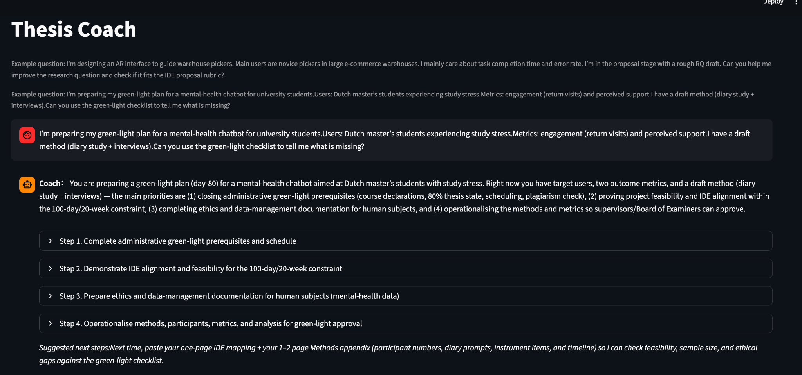
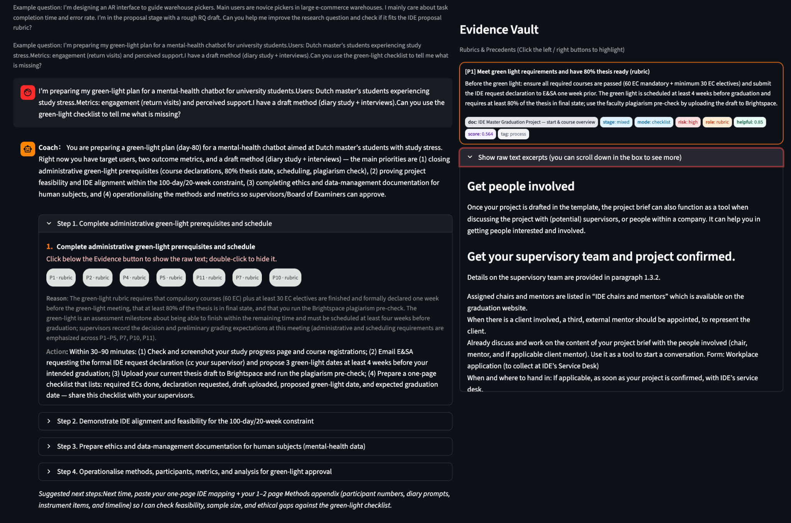

## 🎯 What the System Does

Thesis Coach provides:

### 1. Step-by-step thesis guidance

The left panel delivers structured coaching steps (e.g., feasibility, ethics, methodology), dynamically adapted to the student’s progress and thesis domain.

### 2. Rule-based transparency

Each recommendation is linked to:

- Rubrics (e.g., administrative prerequisites, ethics readiness, method criteria)  
- Precedents and exemplars  
- Methodological rules or program requirements  

So students always see *why* the system gives a suggestion.

### 3. Evidence Vault

The right-hand panel displays:

- Retrieved snippet summaries  
- Raw text excerpts (scrollable)  
- Snippet metadata (source, mode, role, similarity)  
- Ethical or safety references when relevant  

This helps avoid blind trust and encourages evidence-based academic decisions.

### 4. Built-in safety and trust calibration

The system includes:

- Pre-survey for user intent + baseline measures  
- Post-survey for procedural fairness, transparency, trust calibration, and usability  
- Safe-guidance features that flag missing ethics prerequisites or risky research steps  

### 5. Hybrid conversational + structured interaction

Students can chat freely, but the system also:

- Surfaces checklists  
- Prompts for missing thesis components  
- Verifies feasibility within realistic time constraints  
- Helps users draft ethical protocols, methods, and study designs  

---

## 🛠️ Tech Stack

- **Frontend / UI:** Streamlit  
- **Backend:** Python  
- **Database:** PostgreSQL (AWS Lightsail managed database)  
- **Deployment:** AWS Lightsail container service  
- **Data logging:** Pre / post surveys, chat turns, snippet clicks  
- **LLM layer:** Retrieval-augmented generation for rubric-aware feedback  

---

## 🚀 Deployment & Data Export

Full deployment instructions can be generated on request.

This project is typically deployed using an **AWS Lightsail container** (for the Streamlit app) and **AWS Lightsail PostgreSQL** for storage.

### 1. Connect to the Lightsail PostgreSQL database

```bash
psql \
  -h <YOUR_ENDPOINT> \
  -p 5432 \
  -U <USERNAME> \
  -d <DB_NAME> \
  sslmode=require
```

### 2. List all available tables

```bash
\dt
```

### 3. Export survey and interaction logs to local CSV files

```bash
\copy pre_survey_baseline   TO 'pre_survey.csv'   CSV HEADER;
\copy post_survey_baseline  TO 'post_survey.csv'  CSV HEADER;
\copy chat_turns_baseline   TO 'chat_turns.csv'   CSV HEADER;
\copy snippet_clicks_baseline TO 'snippet_clicks.csv' CSV HEADER;
```

These CSVs can then be analyzed in R, Python, or any statistical tool for user studies, UX evaluations, or model audits.

---

## 🖼️ Interface Overview


*Figure 1. Main coaching screen where students receive rubric-aligned guidance.*


*Figure 2. The Evidence Vault interface showing retrieved policy excerpts, relevance scores, and rubric-aligned reasoning supporting each critique. Users can expand or collapse evidence blocks, review raw text from institutional policies, and see how the system connects each piece of evidence to specific thesis requirements.*

---

## 🔲 Procedural Model: Stage × Mode × Gap

The Thesis Coach system is built around a **stage × mode × gap** model of procedural AI assistance.

### 1. Stage — Where the student is in the thesis process

Stages are derived from:

* graduation policy structure
* IDE green-light requirements
* extracted rubrics (`P1–P10`)
* user query context

In the UI, stages appear as collapsible sections (e.g., *Step 1: Administrative requirements*, *Step 2: IDE alignment*, etc.).

---

### 2. Mode — How the system presents procedural information

Modes include:

* **Rubric mode:** show applicable rubric items (P1–P10)
* **Evidence mode:** retrieve policy excerpts and score relevance
* **Reasoning mode:** explain *why* a requirement applies
* **Action mode:** concrete next steps for the user
* **Transparency mode:** show/hide raw evidence
* **Baseline mode:** opaque, non-procedural alternative

Modes correspond to UI components such as the **Evidence Vault**, rubric tags, inline explanations, and collapsible reasoning blocks.

---

### 3. Gap — What is missing from the student's plan

Gaps are inferred through:

* rubric criteria
* policy alignment
* LLM comparison against expected requirements

For each step, the system:

1. Identifies missing requirements
2. Explains the reasoning
3. Retrieves supporting evidence
4. Generates actionable tasks

This forms a procedural feedback loop:
**identify gap → justify gap → show evidence → propose action.**

---

## 📊 Research & Evaluation Use

The logging subsystem (surveys, chat turns, snippet interactions) is designed to support:

* A/B tests of interface variants
* Studies of trust calibration and over-reliance
* Analyses of evidence use (e.g., snippet opening and scrolling)
* Longitudinal tracking across thesis milestones

If you’d like, I can add sections on **installation**, **environment variables**, and **running locally** next.

```
```
